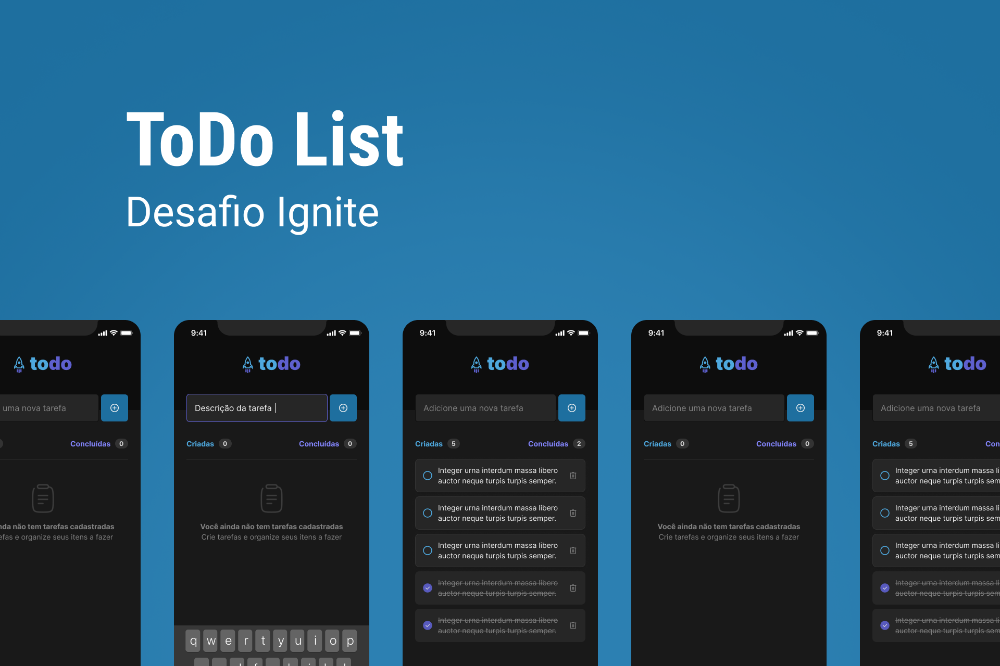

<h1 align="center"> ToDo List 🚀</h1>

  <a href="#-tecnologias">Tecnologias</a>&nbsp;&nbsp;&nbsp;|&nbsp;&nbsp;&nbsp;
  <a href="#-projeto">Projeto</a>&nbsp;&nbsp;&nbsp;|&nbsp;&nbsp;&nbsp;
  <a href="#-layout">Layout</a>&nbsp;&nbsp;&nbsp;|&nbsp;&nbsp;&nbsp;

  

 

  

## 🚀 Tecnologias

Esse projeto foi desenvolvido com as seguintes tecnologias:

- React Native
- TypeScript
- [Node e NPM](https://nodejs.org/)
- Styled-Components
- Async Storage

## 💻 Projeto

O ToDo List é um App para listar tarefas do dia a dia, você pode adicionar uma nova tarefa, marcar como concluída e apagar uma tarefa

## 🔖 Layout

Você pode visualizar o layout do projeto através [DESSE LINK](https://www.figma.com/file/kuzjEXmFg5DM5WEtHjVSGX/ToDo-List-(Copy)?node-id=0%3A1). É necessário ter conta no [Figma](https://figma.com) para acessá-lo.

---

Desafio Proposto pela trilha Ignite de React Native da Rocketseat.
